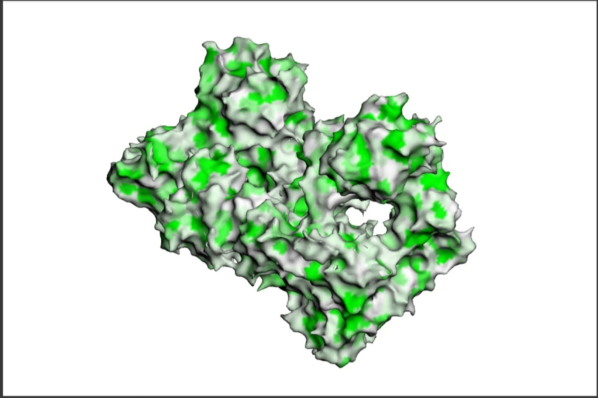
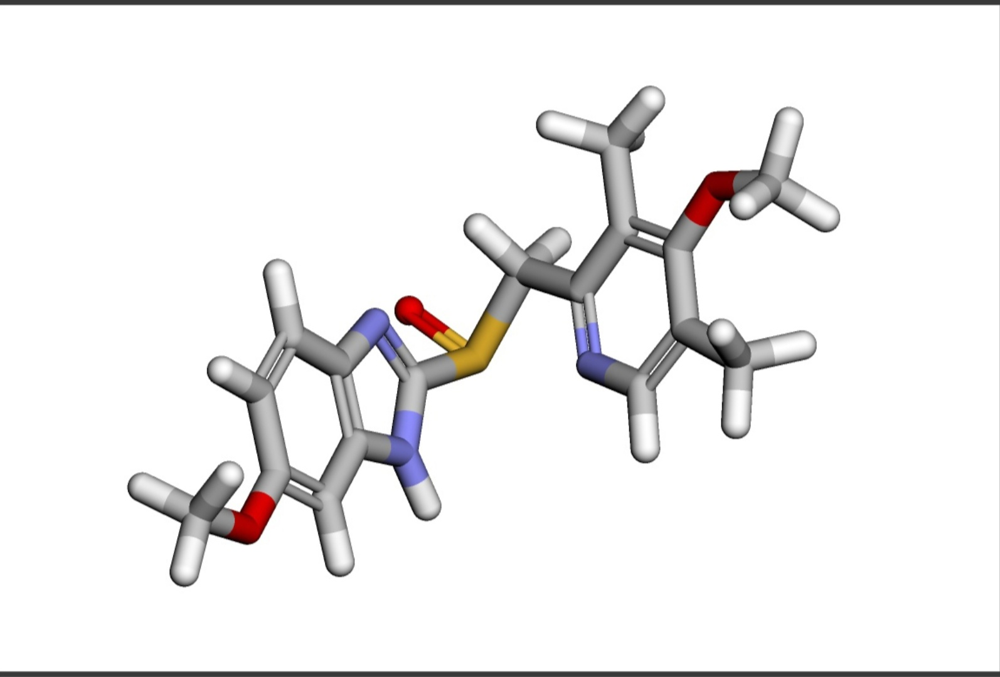
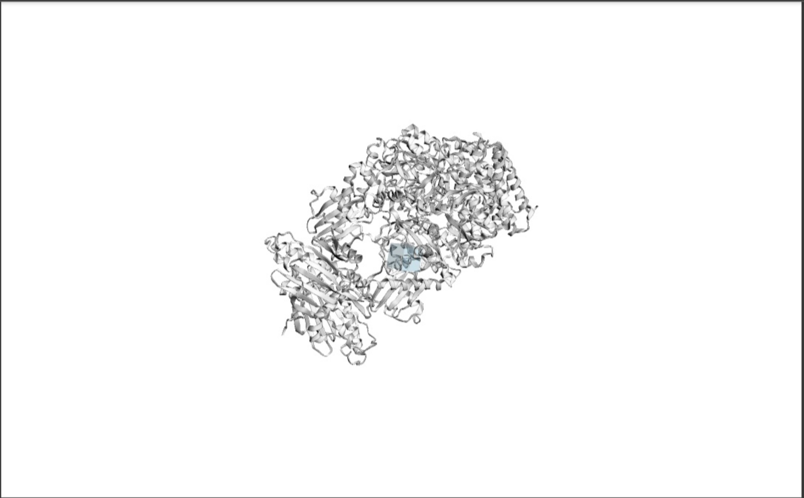
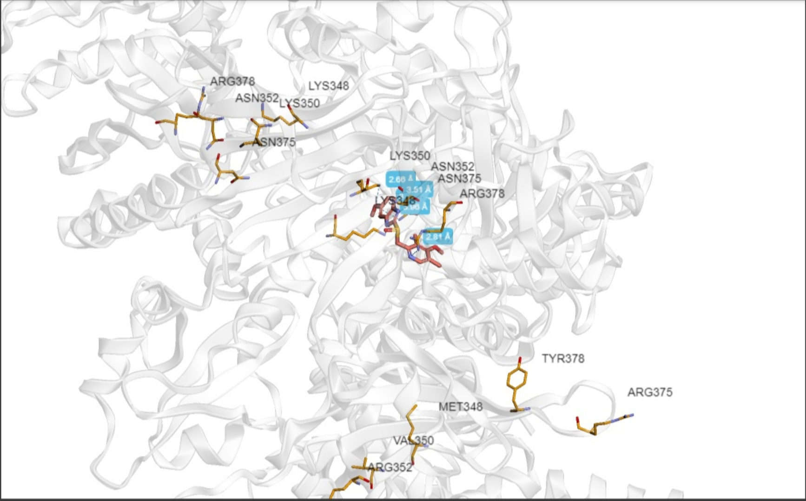

# Задание 6

#### Лекарственное средство: 
Омепразол

Действующее вещество - омепразол
Коммерческие названия: «Гастрозол», «Зероцид», «Лосек», «Омез», «Омекапс», «Омепрус», «Омефез», «Омизак», «Омипикс», «Омитокс», «Оцид», «Плеом-20», «Промез», «Ромесек», «Сопрал», «Улкозол», «Ультоп», «Хелицид», «Хелол»

Угнетает секрецию желудочной кислоты, в связи с чем используется при лечении язвенной болезни желудка и двенадцатиперстной кишки и аналогичных заболеваний (гастроэзофагеальной рефлюксной болезни, эрозивного эзофагита, синдрома Золлингера-Эллисона, эозинофильного эзофагита, полиэндокринного аденоматоза, системного мастоцитоза).

Ингибитор фермента Н+/К+-аденозинтрифосфат (АТФ)-фазы. Тормозит активность Н+/К+ - аденозинтрифосфат (АТФазы (Н+/К+-аденозинтрифосфат (АТФ)-фазы, она же - "протонный насос","протонная помпа") в париетальных клетках желудка, тем самым блокирует перенос ионов водорода и заключительную стадию синтеза соляной кислоты в желудке. Препарат является пролекарством и активируется в кислой среде секреторных канальцев париетальных клеток. Омепразол не действует на ацетилхолиновые и гистаминовые рецепторы.

#### Копия ноутбука с вычислениями:
[basic molecular docking](./Копия_блокнота__basic_molecular_docking.ipynb)

Лучше всего получилось выполнить докинг позиции 1:
[PDB-файл докинга позиции 1](./4279_1_cmpx.pdb)

#### Таргет
[Hsp90-XAP2-AHR cytosolic complex](https://www.rcsb.org/structure/7ZUB)



#### Лиганд 
[Omeprazole](https://www.rcsb.org/ligand/1C6)

SMILES:
```
COC1=CC2=C(C=C1)N=C(N2)S(=O)CC1=NC=C(C)C(OC)=C1C
```



#### Полученный бокс



#### Полученный докинг
 



